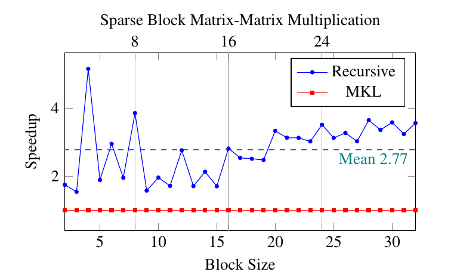
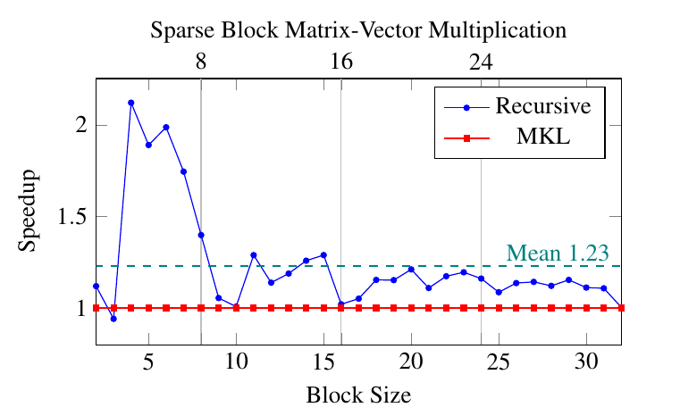
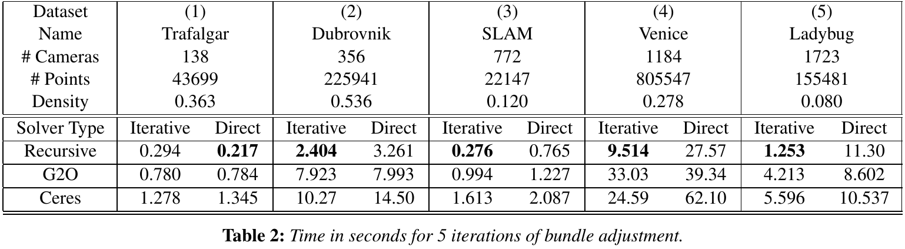

# Eigen Recursive Matrix Extension (ERME)

ERME is an extension to the [Eigen](http://eigen.tuxfamily.org/index.php?title=Main_Page) math library for recursive linear algebra. 

Features
 * Template specializations to allow the creation and usage of recursive matrix types
 * Support for recursive sparse matrices (for example a block-sparse matrix)
 * A recursive LDLT decomposition, based on Eigen's simplicial implemenation
 * Mixed matrix types and mixed recursive solvers for structured optimization problems
 
   
  
## Usage
	
        // See samples/helloRecursive for the full example
        #include "EigenRecursive/All.h"
        int main(int, char**)
        {
             using namespace Eigen;
             using namespace Eigen::Recursive;

             using Block          = Matrix<double, 2, 2>;
             using MatrixOfMatrix = Matrix<MatrixScalar<Block>, 2, 2>;

             MatrixOfMatrix A, B, C;
             setRandom(A);
             setRandom(B);

             C = A * B;

             std::cout << C << std::endl;
             return 0;
        }
    
## Optimization and Benchmarks

To build the bundle adjustment sample you need the [Sophus](https://github.com/strasdat/Sophus) library installed. The other optimization samples as well as the benchmarks are currently part of the [Saiga](https://github.com/darglein/saiga) library.

 * [Bundle Adjustment (included here)](https://github.com/darglein/EigenRecursive/tree/master/samples/bundleAdjustment)
 * [Benchmark - Matrix-Matrix, Matrix-Vector - MKL](https://github.com/darglein/saiga/tree/master/samples/vision/mkl_test)
 * [Benchmark - LDLT - Cholmod](https://github.com/darglein/saiga/tree/master/samples/vision/sparse_ldlt)
 * [Pose Graph Optimization](https://github.com/darglein/saiga/blob/master/src/saiga/vision/pgo/PGORecursive.h)
  * [ARAP](https://github.com/darglein/saiga/blob/master/src/saiga/vision/arap/RecursiveArap.h)
	
## License

This project contains (modified) code from the Eigen library. You can find the Eigen license [here](http://eigen.tuxfamily.org/index.php?title=Main_Page#License).

All of our code is under the MIT License. See the LICENSE file for more information.

Copyright (c) 2019 Darius Rückert <darius.rueckert@fau.de>

